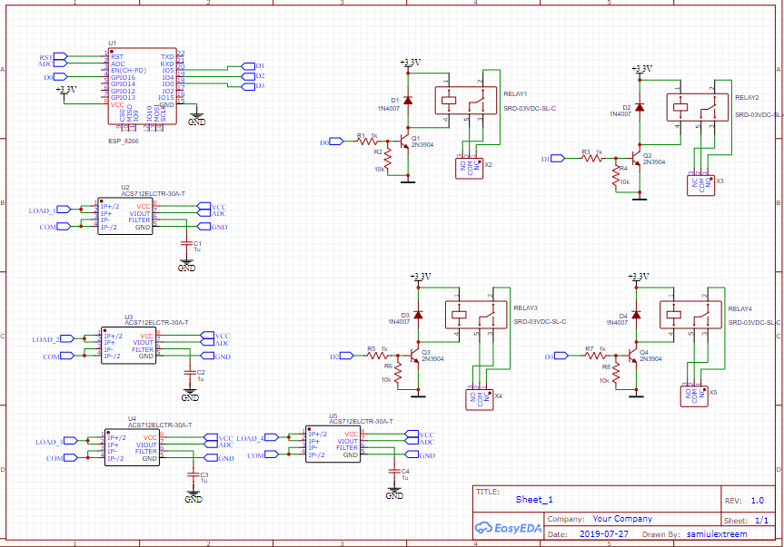

For Final year thesis,  I had to develop a system to control and monitor home appliances for electricity usages and using the data of the used to optimize load carve for load dispatch control. I had developed the system with an web interfarce where both the user and power distributor can monitor and analyze their usage in real time. For remote control i had used esp 8266 with wifi control. Using volatge and current sensing , i wrote an program where real time power usage can be analyzed for further optimization. 
