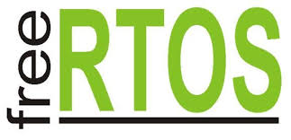

  

During my previous project, i had faced difficulties with getting multiple operation done at the same time. To mitigate the problem i came to know about realtime operating system 
for microcontroller. It had opened us a whole lot of new possibilities which i could explore. But soon i found out that some of the framework usedfor RTOS are proprietory. Some framework are best suited for specific application. After all the consideration, I picked freeRTOS, which is a real-time operating system kernel for embedded devices that has been ported to 35 microcontroller platforms. It is distributed under the MIT License.

I have used RTOS on a varity of task. To name a few , monitoring a IR sensor, controling a stepper motor and updating all these on a screen at the same time has been done. I mainly did these tasks on ESP-32 embedded system. During learning the framework, i had gain concept about task scheduling, timer handling, memory handling, priority managment etc.

