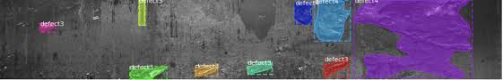

  

Steel is one of the most important building materials of modern times. Steel buildings are resistant to natural and man-made wear which has made the material ubiquitous around the 
world. To help make production of steel more efficient, identifying defects is essancial.The project used U-net to detect and segment the dataset into three faulty class. The dataset is provided by sevel steel and can be found in kaggle [site](https://www.kaggle.com/c/severstal-steel-defect-detection/data).

The main idea is up-sampling  and down-sampling the image. The network consists of a contracting path and an expansive path, which gives it the u-shaped architecture. The 
contracting path is a typical convolutional network that consists of repeated application of convolutions, each followed by a rectified linear unit (ReLU) and a max pooling 
operation. During the contraction, the spatial information is reduced while feature information is increased. The expansive pathway combines the feature and spatial information 
through a sequence of up-convolutions and concatenations with high-resolution features from the contracting path.Using the method in the dataset, we were successufully destsct and 
segment the faulty images into proper defect class. 

