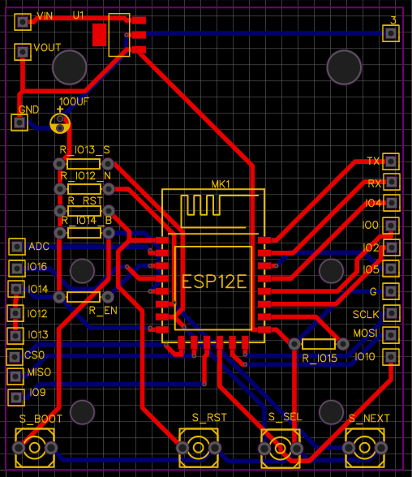

  

To know and get real life experience on circuit design and  PCB fabrication, i planned to make a calculator with the capabilities of performing scientific operation. 
From that thought, i started to design with cheap but powerfull esp 8266 soc. The display liberies used in the project is u86f. The full circuit design and PCB layout is
avalible in this [Link](https://easyeda.com/samiulextreem/Device_advance).
The code i had written , i had used Arduino and C++ for mathmatical calculation. The code can be found in this [Link](https://github.com/samiulextreem/Device_advance).
